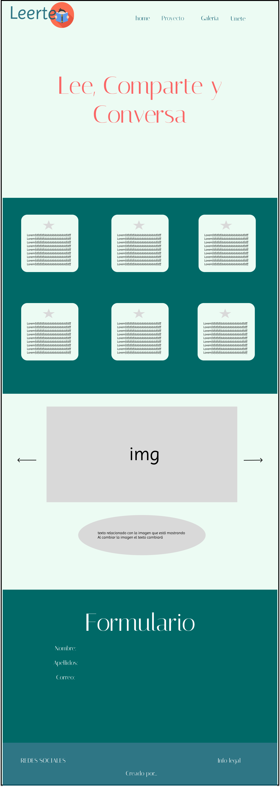

# PROYECTO DIW - EMILIO BLASCO

Página Web del Club de Lectura **"LEERTE"**

## **REQUISITOS INICIALES DEL PROYECTO** 📋

- **Requisitos técnicos**
  - Crear un sitio web responsive.
  - Tecnologías obligatorias para el diseño web:
    - HTML
    - CSS
    - SASS
  - Tecnologías opcionales para el diseño web:
    - Bootstrap
    - JavasScript
  - Creación de un Repositorio GIT
  - Crear un boceto inicial con **Figma**
- **Requisitos estructurales y diseño**
  - Web estructurada con una cabecera, cuerpo y pie de página
  - Logo y menú con al menos 3 elementos
  - Uso de carrusel, vídeos o scroll animado
  - Footer con el nombre del autor del sito web

## **BOCETO** 🖌️​

Boceto inicial del index.html realizado con la aplicación web **Figma**

[Web Figma](https://www.figma.com/)

## **INSTALACIÓN DE DEPENDENCIAS** 🔧

Para poder ejecutar la aplicación en un entorno de desarrollo es necesario tener instaladas las siguientes dependencias.

- NPM
  - `npm -version` para comprobar si está instalado en el equipo
  - `npm install` si no está instaldo
- Node
  - `node --version` Para comprobar si está instalado en el equipo
- SASS
  - `sass --version` Para comprobar si está instalado en el equipo
  - `npm install -g node-sass` Para instalar SASS de forma global en el equipo. A veces es necesario utilizar también el comando `npm install -g sass`

## **HERRAMIENTAS USADAS PARA AYUDA DE DESARROLLO** 🛠️

- [Font Pair](https://www.fontpair.co/): Usado para seleccionar fuentes.
- [Google Fonts](https://fonts.google.com/): Usado para importar las fuentes seleccionadas
- [Adobe Color](https://color.adobe.com/es/create): Usado para seleccionar la paleta de colores
- [Font Awesome](https://fontawesome.com/): Usado para descargar iconos
- [Pexels](https://www.pexels.com/es-es/): Usado para descargar imágenes
- [Neumorphism.io](https://neumorphism.io/#e0e0e0): Usado para el diseño del botón del formulario
- [Universe.io](https://uiverse.io/): Usado para el diseño de las tarjetas de la galeria

## **AUTOR** ✒️

- **Emilio Blasco Carrascosa** - _Estudiante de 2º de DAW_
